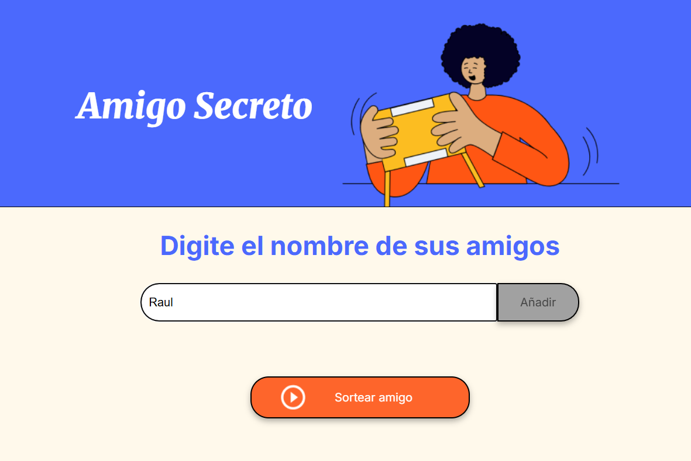
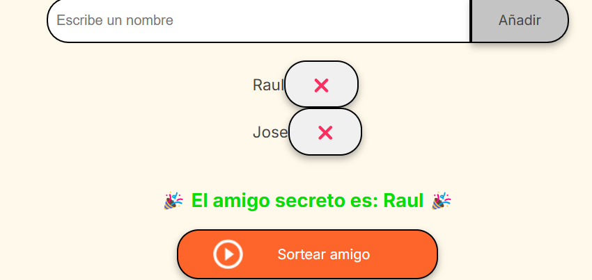

# 🎁 Amigo Secreto

¡Callenge **Amigo Secreto**! Esta aplicación web te permite organizar fácilmente un sorteo de Amigo Secreto, agregando nombres y realizando la asignación de forma aleatoria.

## ✨ Funcionalidades

- Agregar participantes con sus nombres.  
- Realizar el sorteo automáticamente asignando a cada persona su Amigo Secreto.  
- Mostrar los resultados de forma clara y sencilla.  
- Opción para copiar o descargar la lista de asignaciones.  

## 🖥️ Capturas de Pantalla

### 📌 Agregar Participantes  
  

### 📜 Resultados del Sorteo  
  

### 🎲 Eliminar Participantes  
  

## 🚀 Instalación y Uso

**Clonar el repositorio:**  
   ```bash
   git clone https://github.com/tu-usuario/amigo-secreto.git
   cd amigo-secreto
